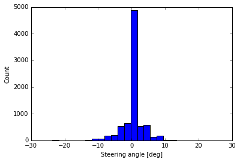

# Behavioral Cloning - Teaching a Car to Drive Itself by Mimicking Human driving

This is part of Udacity's Self Driving Car Project.

Unlike other projects, the aim of this project is to train a car to drive itself by mimicking a human driver. The traning consists of getting the (toy) car to recognize road images and learn to steer left/right/center to keep driving on the road. The main input is a series of left/right/center images along with (human-trained) steering angles. With enough training data, the car will learn to keep itself on road by outputting correct steering angles. Sounds fairly simple, but the execution is anything but.

#### Summary

The simulated car drives autonomously along the Track. See video:


--- 

## Data 

As with most machine learning projects, a neural network needs data (and lots of it!) to train. The biggest challenge in this project was to generate enough simulated driving data. This was a big challenge for me, as I suck at most video games. I tried both the simulators - one with mouse control (beta simulator) and other with just keyboard controls. The mouse-controlled simulator was smoother driving, but it generated only CENTER camera images, while the keyboard-only simulator generated all (CENTER/LEFT/RIGHT camera) images.

Two things helped me:

#### Udacity data

Udacity included a dataset of ~8K samples of Center/Left/Right camera images. 

#### My own data

I generated several datasets of varying length (5-10 min simulated driving) ranging from 10K - 25K samples. In the end, added up both mine and Udacity datasets for my final training, which resulted in about 35-40K samples. For me this was one of the most time consuming steps as I wasn't sure how much data to generate. Thankfully, reading a few articles about others' experiences of their own training made me comfortable about 30K-40K training samples. 

#### Exploratory analysis: Steering Angles 

Plotting the Udacity training data, one sees that because of the track, most of the steering is on the left.


The second chart shows a better picture of steering: much of the driving is straight (0 degree), but there are pleny of Lefts (-ve angles) and some Rights (+ve angles). There are also some very sharp turns (angles > 8-10 degrees) indicating a curving track.



Clearly, we would have to train the car for both steering straight and left/right appropriately. 

### Data Augmentation

As suggested, we would have to augment the training data to let the car detect adverse conditions (light/dark images, clipped borders, etc.) As recommended by a few people (see in Acknowledgements), I augmented the data in three key ways:

- Augmented Brightness: changed brightness of images by a small amount (darker/lighter)
- Image Translation: translated images (shifted in x/y dimension)
- Image Flipping: randomly flipped some images horizontally

This augmentation helps the network detect images on unknown tracks and generalize better.

### Steering Smoothing

By far, the biggest problem was getting the car to steer right/left appropriately based on the track. Sometimes it would jerk sharp right/left. Reading recommendations from Vivek Yadav and Mohan Karthik helped; they recommended adding a small smoothing angle (+/- 0.25 - 0.3) to Right/Left images to simulate center driving. I tested out with steering bias of 0.25, but finally settled with 0.3. This worked well.

### Image Preprocessing

Each image was pre-processed so that only the most effective part of the image was retained and the distracting elements were removed. 

Having already decided to use the NVIDIA end-to-end driving network architecture (which uses an image of 66x200x3 dimensions), after some trial and error I decided on cropping top part of the original image to produce a reduced size image.

The original image was size 160 (H) x 320 (W) pixels (x 3 Channels [=RGB]).


The cropped image: 100 (H) x 250 (W):


The cropped image was resized further to 66x200x3 to fit the NVIDIA end-to-end model.


## Model Architecture 

I used the (simpler/smaller) NVIDIA end-to-end driving architecture. I modified it a little bit to include a new 1024-dense fully connected layer. Various architectures were tested manually with trial-and-error, some with less satisfactory results than other (= car drove off-track).

The final architecture is as follows:

| Layer (type)                     | Output Shape          | Param #     | Connected to            |                   
|__________________________________|_______________________|_______________________________________|
| lambda_1 (Lambda)                | (None, 66, 200, 3)    | 0           | lambda_input_1[0][0]    |        
| conv0 (Convolution2D)            | (None, 31, 98, 24)    | 1824        | lambda_1[0][0]          |         
| conv1 (Convolution2D)            | (None, 14, 47, 36)    | 21636       | conv0[0][0]             |         
| dropout_1 (Dropout)              | (None, 14, 47, 36)    | 0           | conv1[0][0]             |         
| conv2 (Convolution2D)            | (None, 5, 22, 48)     | 43248       | dropout_1[0][0]         |         
| conv3 (Convolution2D)            | (None, 3, 20, 64)     | 27712       | conv2[0][0]             |         
| dropout_2 (Dropout)              | (None, 3, 20, 64)     | 0           | conv3[0][0]             |        
| conv4 (Convolution2D)            | (None, 1, 18, 64)     | 36928       | dropout_2[0][0]         |         
| flatten_1 (Flatten)              | (None, 1152)          | 0           | conv4[0][0]             |         
| fc0 (Dense)                      | (None, 1024)          | 1180672     | flatten_1[0][0]         |         
| dropout_3 (Dropout)              | (None, 1024)          | 0           | fc0[0][0]               |         
| fc1 (Dense)                      | (None, 512)           | 524800      | dropout_3[0][0]         |         
| dropout_4 (Dropout)              | (None, 512)           | 0           | fc1[0][0]               |         
| fc3 (Dense)                      | (None, 10)            | 5130        | dropout_4[0][0]         |         
| dropout_5 (Dropout)              | (None, 10)            | 0           | fc3[0][0]               |         
| fc4 (Dense)                      | (None, 1)             | 11          | dropout_5[0][0]         |         


- Total params: 1,841,961
-  Trainable params: 1,841,961
- Non-trainable params: 0

Additionally, I tried the VGG model and a smaller VGG model; however, as these models had more params, the training times were excrutiatingly long. As a result, I ended up using mostly the NVIDIA model. 

I used a `Lambda` layer as the first layer to normalize the images:
```python
   # normalize between -0.5to 0.5
    model.add(Lambda(lambda x: x/255. - 0.5, input_shape=(IMG_HEIGHT, IMG_WIDTH, NUM_CHANNELS) , output_shape=shape))
```
#### Convolution Layers

- 24 filters of kernel 5x5
- 36 filters of kernel 5x5
- 48 filters of kernel 5x5
- 64 filters of kernel 3x3
- 64 filters of kernel 3x3

#### Fully Connected Layers

- 1024 Dense layer (additional layer not included in NVIDIA model)
- 512 Dense layer 
- 10 Dense layer
- 1 Dense layer (final)

#### Regularization

Regularization was done by:
- Dropout ranging from 0.2 to 0.5 between CNN and FC Layers
- Learning Rate reduction (using Keras callbacks)
```python 
lr_schedule = ReduceLROnPlateau(monitor='val_loss', factor=0.2, patience=2, verbose=1)
``` 


#### Training 
* **Adam Optimizer** Used the default Adam optimizer with initial `learning_rate=0.0001`
* **Generator** Used a batch generator to continuously generate image batches of size 128. Tested out batch sizes of 64 and 256 as well, but stuck with 128 as this was the most optimal. During training, my MacbookPro kept running out of GPU memory and thus failed intermittently. This is likely a bug in TensorFlow. Thus I ended up training mostly on CPU.

#### Driving Results 
On Track1 the model runs well. The simulated driving closely mimics the training samples; this is indicated most closely when the car takes sharp left turns after crossing the bridge. Additionally, it swerves a little on the bridge as I had manually added some swerving and recovery samples, especially while crossing the bridge. 

- Recovery. The car recovers well when is it swerving; this is likely because of recovery data (moving from close to right/left barries to the center of the lane) I added. 


#### Reflections

This was one of the most interesting and exasperating projects. It took much longer than anticipated due to three main reasons: 

- Generating the training data took time
- Testing out candidate model architectures took a long time. This was also among the most frustrating parts of the project. In the end, the NVIDIA model turned out quite good. As I was doing most of the training without a GPU, this added to the training. 
- Tuning the hyper params took a lot of trial/error
- Steering. Smoothening of steering took some effort. 

## Acknowledgements

I gratefully acknowledge ideas from various sources, including the following:

* [Vivek Yadav's Medium post on data augmentation](https://chatbotslife.com/using-augmentation-to-mimic-human-driving-496b569760a9)
* [NVIDIA's paper on end-to-end training](https://arxiv.org/pdf/1604.07316v1.pdf)
* [Mohan Karthik's post on behavioral cloning](https://medium.com/@mohankarthik/cloning-a-car-to-mimic-human-driving-5c2f7e8d8aff#.6qjlvak6q)